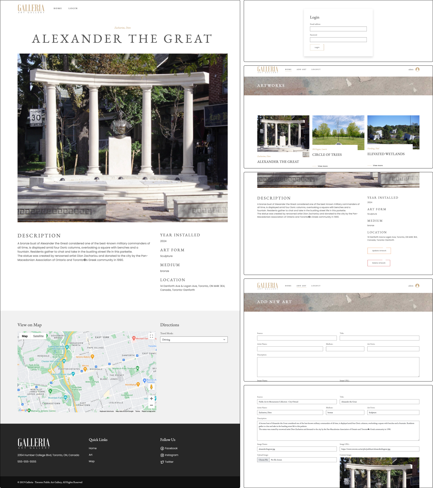

# Public Art Management System

## Project Description

The Public Art Management System is a web application designed to manage public art installations. It provides an admin panel for managing artworks, including CRUD (Create, Read, Update, Delete) operations and image uploads. The application uses Bootstrap for responsiveness and custom CSS for styling. Additionally, it integrates Google Maps for displaying the locations of the artworks.

## Technologies Used

`PHP`, `MySQL`, `HTML`, `CSS`, `Bootstrap`, `JavaScript`

## Features

- CRUD Operations: Create, Read, Update, and Delete artworks.
- Admin Panel: Dedicated admin panel for data management.
- Image Upload: Upload and manage images for each artwork.
- Google Maps Integration: Display and manage artwork locations using Google Maps.
- Pagination: Easy navigation through large lists of artworks.
- Open-source Data: Utilizes open-source data of artworks in Toronto.

## Demo

The CMS is available [here]("http://publicart-cms.free.nf"). To test the admin, click Login and enter the following cridentials: `admin@gmail.com` for email and `password` for password.

## Database Design

The database consists of four main tables: artworks, artists, locations, and users. The artworks table has a foreign key ArtistID that references the ArtistID in the artists table (one-to-many relationship where one artist can have multiple artworks). The artworks table also has a foreign key LocationID that references the LocationID in the locations table (one-to-many relationship where one location can have multiple artworks).

### `Artworks` Table:
- `_id`: Primary key, auto-incremented `integer`.
- `Source`: Source of the artwork, `varchar`(54).
- `Title`: Title of the artwork, `varchar`(59).
- `Medium`: Medium used in the artwork, `varchar`(316).
- `ArtForm`: Form of art, `varchar`(21).
- `Status`: Status of the artwork, `varchar`(18).
- `ImageName`: Name of the image file, `varchar`(52).
- `ImageURL`: URL of the image, `varchar`(93).
- `Image`: Image data, stored as a `longblob`.
- `YearInstalled`: Year the artwork was installed, `varchar`(4).
- `Description`: Description of the artwork, `text`.
- `ImageOrientation`: Orientation of the image, `varchar`(9).
- `ArtistID`: Foreign key, references ArtistID in artists table, `int`.
- `LocationID`: Foreign key, references LocationID in locations table, `int`.

### `Artists` Table:
- `ArtistID`: Primary key, auto-incremented `integer`.
- `Artist`: Name of the artist, `varchar`(64).

### `Locations` Table:
- `LocationID`: Primary key, auto-incremented `integer`.
- `Location`: Name or address of the location, `varchar`(84).
- `Ward`: Ward number, `int`(2).
- `WardFullName`: Full name of the ward, `varchar`(22).
- `latitude`: Latitude coordinate, `float`(10,6).
- `longitude`: Longitude coordinate, `float`(10,6).

### `Users` Table:
- `id`: Primary key, auto-incremented `integer`.
- `name`: Name of the user, `varchar`(25).
- `email`: Email of the user, `varchar`(100).
- `password`: Password, `varchar`(100).
- `active`: `Enum`(‘Yes’, ‘No’), indicates if the user is active.
- `dateAdded`: `Datetime`, date the user was added.

## Interface

